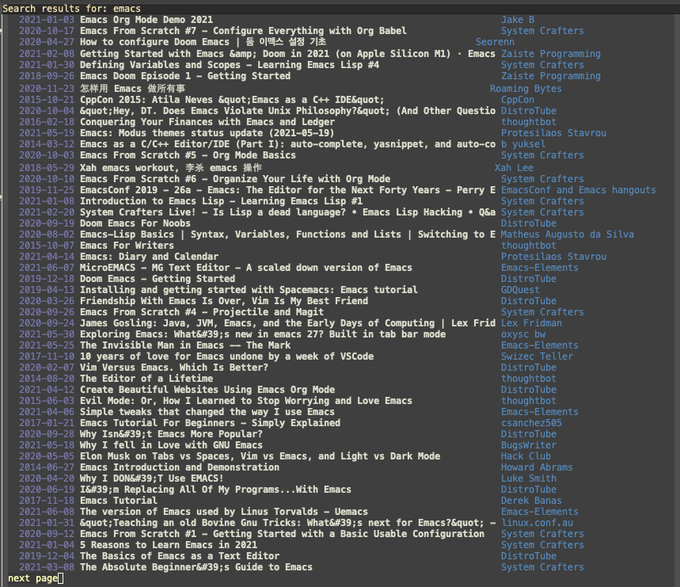

# Youtube.el

I created this package because I wanted an easy to use search interface on top of youtube-dl.  This package provides a simple interface for searching for videos via the YouTube Data API and a system of listing the saved videos to open the file or delete them.

# Setup and usage

Once you add this package to your load path, you'll need to set the
value of the `youtube-api-key` variable to be an API key that you can
use to access the Google YouTube Data API.  You should also set
`youtube-storage-dir` to be a directory where you want your saved files to be stored.

The two main commands to use are `youtube-search` which will prompt
you for a search term.  On the list view you can use `<return>` to
download a video and `o` to open a downloaded video.

To view all saved videos you can use the `youtube-list` command which
will open a buffer showing all saved videos.  You can then use
`<return>` to open a saved file or `d` to delete the file.

To correctly open a file you may need to redefine the
`youtube-open-file` function if you're not on macOS.  This function
takes one argument, the file to be opened, and should open the file.
